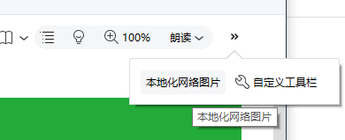
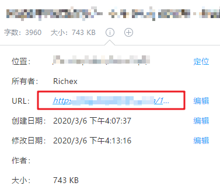

# 为知笔记图片本地化插件  

    

一个为知笔记（WizNote）的图片本地化插件，可以将笔记中所有的网络图片下载至笔记本地并替换。

保存在为知笔记中的图片，很多图片有可能是引入的网络资源，时间一长如果图片服务器被关闭或者图片被删除导致无法访问，那么笔记中的图片也将无法加载显示。

通过本插件可以将笔记中的图片全部保存在本地笔记中，比起引用网络资源，保存到本b地后图片和笔记保存在一起，不用再担心图片资源失效的问题，还可以在没有网络的环境下正常查看笔记。

插件暂时仅在 Windows 10 下测试通过，其他版本或系统欢迎使用过的通过 Issue 反馈。

### 插件名称

PictureLocalize（图片本地化）

### 插件安装

下载 [Picture.Localize.wizplugin](https://github.com/richex-cn/wiz-plugin-picture-localize/raw/master/Picture.Localize.wizplugin) 文件，双击运行即可。

> Note: 如果您使用的是便携版本的为知笔记，可能无法直接双击为知笔记 plugin 文件进行安装，可以将下载的文件拖放到为知笔记窗口上面进行安装（建议拖放到标题栏，在文档窗口中会被当成附件添加）。

### 插件位置

笔记顶部工具栏的**本地化网络图片**按钮，如下图：

### 插件用途

提供图片本地化功能，将笔记中所有的网络图片下载至笔记本地并替换，主要是为了解决以下几个问题：

1. 预防笔记图片为网络图片时，在离线环境下无法查看
2. 防止网络资源服务器关闭服务等无法访问的情况下，图片无法正常打开的问题

将所有图片下载并转换为笔记自带图片，有效的预防了上述可能遇到的问题，同时也可以很方便的进行导出等工具（解压ziw文件）

### 使用方式

在笔记是**非编辑**的状态下，点击工具栏中的**本地化网络图片**按钮，稍等片刻后会出现 **所有网络图片已经下载并转换到本地！** 的提示。

兼容4.5以后的客户端版本，插件调试开发的环境是为知笔记 `4.11.18` 版本，Windows 10。

- **可能出现没考虑到的情况，使用后出现问题可以通过笔记历史版本功能还原即可，对于遇到的问题欢迎提 [Issue](https://gitee.com/Richex/wiz-plugin-picture-localize/issues/new) 或者 PR**
- 考虑到编辑器很多，无法做到一一兼容，所以请统一在笔记是**非编辑**模式下使用该插件
- 点击按钮后的等待时间视网络情况不同，建议耐心等待不要做其他操作
- 出现提示后即代表笔记已更新，会自动刷新笔记，如需还原可通过**历史版本**功能恢复
- 兼容任意格式的笔记（Markdown 和 HTML），插件只会处理网络图片资源，笔记中**引入的本地图片不会二次处理**，放心使用！

### 注意事项

> 关于部分使用图片懒加载的网站（例如 `data-original` 等属性）

部分网页为了优化体验减少资源浪费，会采用图片懒加载技术，页面没有滚动到对应位置时图片不会显示或者显示成 loading 加载图片，针对这个问题，请各位**在保存文章的时候手动快速滑动一下网页，保证所有图片正常加载显示之后，再进行保存**就不会有问题了。

之所以不考虑在插件当中直接实现，是因为懒加载的图片真实路径存储位置无法确定，不同网站、不同开发者会有各种不同的变化，可以用 `data-original="imgSourceUrl"` 也可以用 `data-pic` `data-img` 等等，更甚者可以直接用类似于 `data-img="0"` 标记图片索引的方式，所以各位记住保存之前，先滚动一下页面，图片全部正常显示后再保存笔记就可以解决啦。

对于已经保存的笔记又使用了图片懒加载的网站，可以尝试在笔记信息中找到保存时的原网页重新保存一遍，如下图：

如果没有 URL 或者原网页失效的情况，可以通过源代码等方式保存图片，如果仍然无法解决，可以尝试联系我帮忙看一下。

> 关于二次开发

如果你需要自行进行二次开发，请注意 `src` 目录中的文件都是 UTF-8 编码，但是官方要求是 Unicode (UTF-8 LE 小端序) 编码，在调试和打包时请手动将 `src` 目录下的所有文件转换编码，否则可能出现异常。

### 其他说明

- 因为个人在保存文档的过程中，遇到一些笔记在保存后仍然使用网络图片的情况（例如粘贴内容到Wiz.Editor.md编辑器中等），为了防止网络图片资源失效，特做了一个小插件以解决该问题，将图片保存至笔记中。
- 插件是以 4.5 以后的版本调试开发的，因为 4.5 版本前后的客户端插件开发方式不同，所以不保证 4.5 之前的客户端兼容性。
- 顺便的确想吐槽一些开发文档确实是有点乱，建议官方优化一下，这样也好让更多开发者为Wiz的插件生态做贡献不是吗？

# 开发文档

### 文件说明

`/Picture.Localize.wizplugin` 为插件文件，通过将 `/src` 下的文件打包成 `zip` 并将后缀名更名为 `wizplugin` 即可。

### 相关链接

[如何安装为知笔记插件](http://www.wiz.cn/wiz-install-plugin.html)

[4.4 版本插件开发API文档](http://www.wiz.cn/manual/plugin/)

[4.5 版本插件开发API文档](http://www.wiz.cn/plugin-api-document-45.html)

